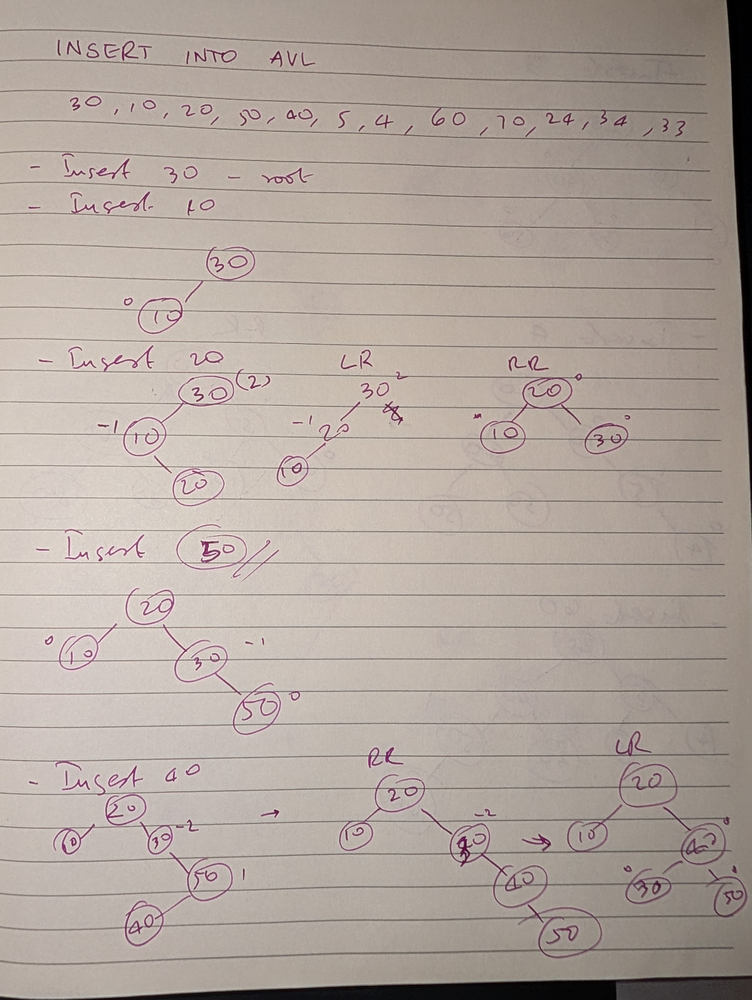
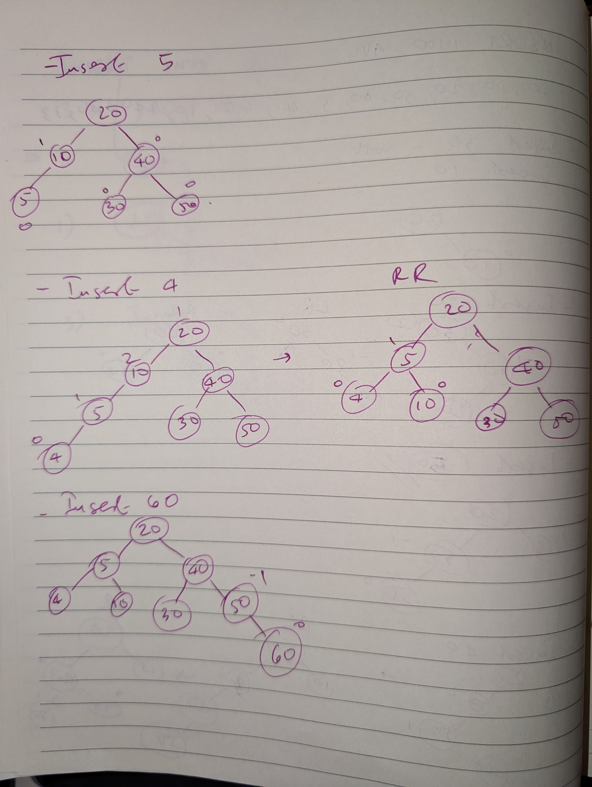
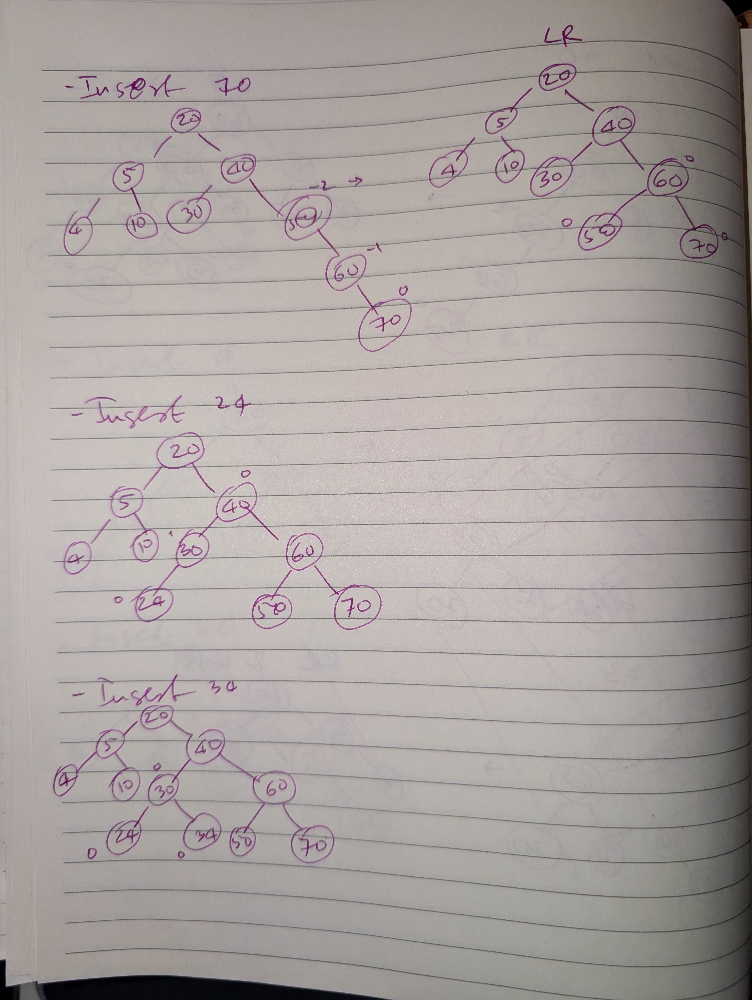
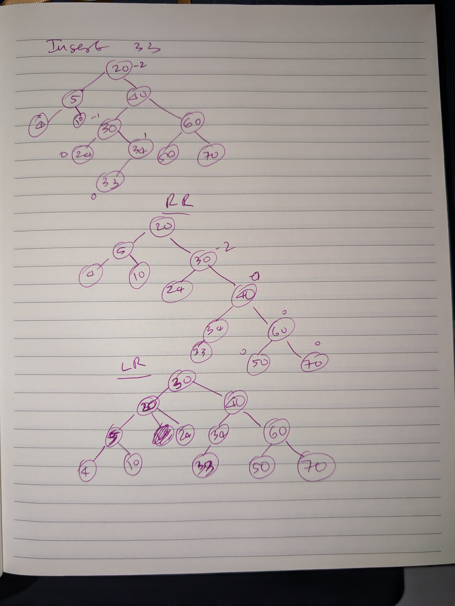
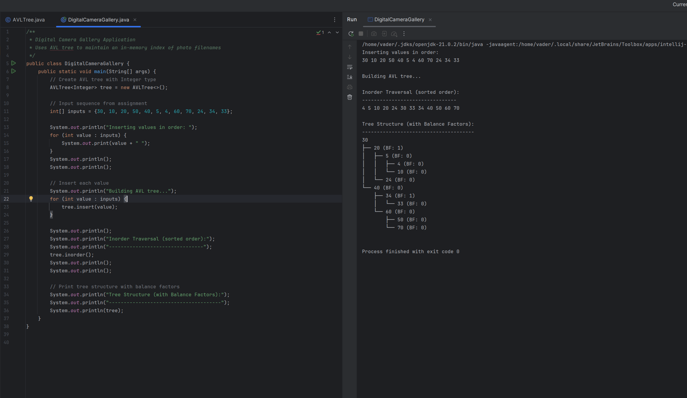

# Assignment #4: AVL Trees Implementation

In this assignment I implement an AVL (Adelson-Velsky and Landis) tree data structure for a digital camera's firmware. The camera needs to maintain an in-memory index of photo filenames so the gallery can scroll in alphabetical or timestamp order, jump to the next/previous file, and insert or delete entries efficiently. Since new files usually arrive in nearly sorted order (e.g., DSC_1001, DSC_1002, ...), a plain BST would stretch into a long chain and slow down operations. An AVL tree keeps the directory index balanced by applying rotations after inserts and deletes.

---

## Part 1: Theory (3 Marks)

### a) What is AVL tree, property and why we need AVL tree?

**AVL Tree:**
An AVL tree is a self-balancing binary search tree (BST) where the heights of the two child subtrees of any node differ by **at most one**. It was named after its inventors Adelson-Velsky and Landis.

**AVL Property:**
For every node in an AVL tree, the balance factor (BF) must be -1, 0, or 1. The balance factor is calculated as:
```
Balance Factor = Height(Left Subtree) - Height(Right Subtree)
```

**Why we need AVL tree:**
1. **Prevents Degeneration:** A regular BST can become a linked list (worst case O(n) for all operations) when data is inserted in sorted order. AVL trees maintain O(log n) height.
2. **Guaranteed Performance:** All operations (search, insert, delete) are guaranteed to be O(log n) in worst case.
3. **Better for Sequential Data:** When data arrives in nearly sorted order (like camera filenames DSC_1001, DSC_1002...), AVL trees stay balanced while BSTs become chains.
4. **Efficient Navigation:** Predecessor/successor lookups stay fast because the tree height is always logarithmic.

### b) What are the different types of rotation for balancing AVL tree and explain?

There are four types of rotations to balance an AVL tree:

**1. Right Rotation (RR / Single Right Rotation):**
- Used when left subtree is taller and left child's left subtree is taller
- Balance Factor: Parent > 1, Left child > 0

**2. Left Rotation (LL / Single Left Rotation):**
- Used when right subtree is taller and right child's right subtree is taller
- Balance Factor: Parent < -1, Right child < 0

**3. Left-Right Rotation (LR / Double Rotation):**
- Used when left subtree is taller but left child's right subtree is taller
- Balance Factor: Parent > 1, Left child < 0

**4. Right-Left Rotation (RL / Double Rotation):**
- Used when right subtree is taller but right child's left subtree is taller
- Balance Factor: Parent < -1, Right child > 0

**Rotation Process:**
1. Identify the unbalanced node (|BF| > 1)
2. Determine which case applies based on balance factors
3. Perform the appropriate rotation(s)
4. Update heights of affected nodes

### c) Explain a use case or application where we need AVL data structure and what will be the advantage of using AVL in that application.

- A digital camera's software needs to maintain an in-memory index of photo filenames as discussed in this assignment.
- Database systems where reads are more frequent than writes.
- Routing algorithms for gps. They can help in calculating the shortest path. This is also useful in network routes.
- Sorted file systems.

**Advantages of AVL Tree:**

1. **Handles Sequential Inserts:** Camera files arrive in order (DSC_1001, DSC_1002, DSC_1003...). A BST would create a chain, but AVL stays balanced keeping performance O(logn).

2. **Fast Navigation:** Finding next/previous file (predecessor/successor) is O(log n) guaranteed, not O(n) like a degenerate BST.

3. **Efficient Ordered Listing:** Inorder traversal for displaying photos in order is O(n) with guaranteed O(log n) height.

4. **Memory Efficient:** No need for heavy on-disk indexes - everything stays in memory with predictable performance.

5. **Responsive on Limited Hardware:** Camera firmware runs on constrained hardware. AVL's guaranteed O(log n) operations ensure consistent performance.

**Other Real-World Applications:**
- Database indexes (when you need ordered traversal)
- File system directories (maintaining sorted order)
- Priority queues with range queries
- Any application needing sorted data with frequent inserts/deletes

---

## Part 2: Visualization and Algorithm (4 Marks)

### a) Tree Construction with Balance Factors










### b) Worst-Case Time Complexities

**Search:** O(log n)
- Height is always O(log n) due to balancing
- At most log₂(n) comparisons needed

**Insert:** O(log n)
- BST insert: O(log n)
- Update heights: O(log n)
- Rebalance (rotations): O(1) per rotation, at most O(log n) rotations
- Total: O(log n)

**Delete:** O(log n)
- Find node: O(log n)
- Delete node: O(log n)
- Update heights: O(log n)
- Rebalance: O(log n) in worst case
- Total: O(log n)

**Comparison with BST:**
- BST worst case: O(n) for all operations (when tree becomes a chain)
- AVL worst case: O(log n) for all operations (always balanced)

---

## Part 3: Implementation (2 Marks)

### Code Implementation

The implementation consists of two files:

1. **AVLTree.java** - The AVL tree data structure
   - Node class with key, height, left, right
   - Insert operation with automatic balancing
   - Four rotation methods (left, right, left-right, right-left)
   - Balance factor calculation
   - Inorder traversal

2. **DigitalCameraGallery.java** - The application
   - Builds AVL tree from given input sequence
   - Prints inorder traversal

**Key Features:**
- Automatic height updates after insertions
- Balance factor calculation for each node
- Automatic rotation when |BF| > 1
- All four rotation types implemented

**Code Structure:**

```java
// AVLTree.java - Data Structure
public class AVLTree {
    // Node class with height tracking
    // Insert method with rebalancing
    // Rotation methods
    // Inorder traversal
}

// DigitalCameraGallery.java - Application
public class DigitalCameraGallery {
    public static void main(String[] args) {
        // Build tree from input sequence
        // Print inorder traversal
    }
}
```

### Output

```
Inserting values in order:
30 10 20 50 40 5 4 60 70 24 34 33

Building AVL tree...

Inorder Traversal (sorted order):
--------------------------------
4 5 10 20 24 30 33 34 40 50 60 70

Tree Structure (with Balance Factors):
--------------------------------------
30
├── 20 (BF: 1)
│   ├── 5 (BF: 0)
│   │   ├── 4 (BF: 0)
│   │   └── 10 (BF: 0)
│   └── 24 (BF: 0)
└── 40 (BF: 0)
    ├── 34 (BF: 1)
    │   └── 33 (BF: 0)
    └── 60 (BF: 0)
        ├── 50 (BF: 0)
        └── 70 (BF: 0)


Process finished with exit code 0

```



---

## Conclusion (1 Mark)

### How Balancing Changed the Height vs. Plain BST

**Plain BST on this input:**
If we insert 30, 10, 20, 50, 40, 5, 4, 60, 70, 24, 34, 33 in order, a regular BST would probably create a chain-like structure, especially with the early sequential inserts (30, 10, 20). The height could be close to n (12 nodes), making operations O(n).

**AVL Tree:**
With AVL balancing, this tree maintains a height of approximately log(12) around 3-4 levels. This ensures all operations remain O(log n) = O(log 12) ≈ 4 comparisons maximum.

**Height Comparison:**
- Plain BST worst case: ~12 levels (chain)
- AVL Tree: ~4 levels (balanced)


### Where AVL is Preferable

**AVL vs BST:**
- **Use AVL when:** Data arrives in sorted/nearly sorted order, or you need guaranteed O(log n) performance
- **Use BST when:** Data is random and you don't need guarantees, or you want simpler implementation

**AVL vs Hash Tables:**
- **Use AVL when:** You need ordered traversal, range queries, predecessor/successor operations, or sorted output
- **Use Hash Tables when:** You only need fast lookups by key, don't need ordering, and can accept O(n) worst case
